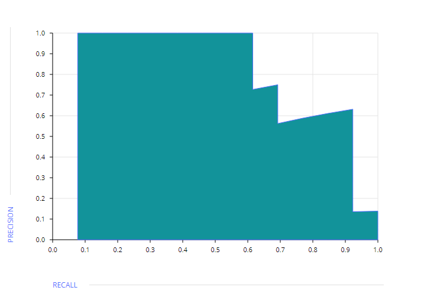
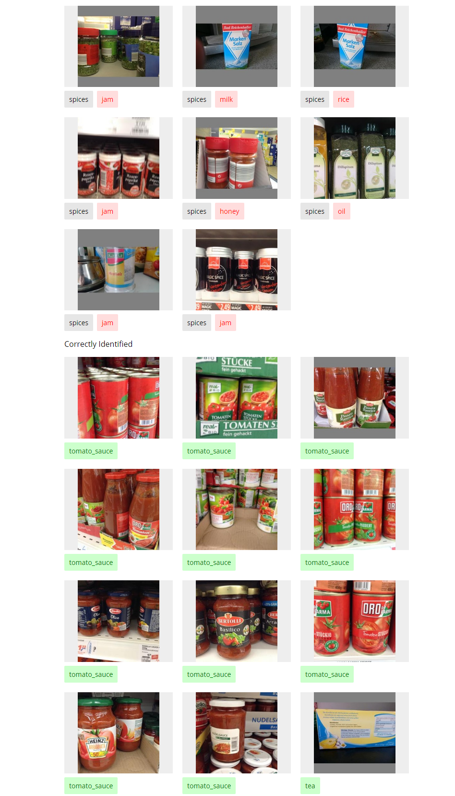

# Multi class image classification using Freiburg Groceries Dataset

The Freiburg Groceries Dataset consists of 5000 256x256 RGB images of 25 food classes. I have used Transfer Learning using pre trained 
VGG weights to make a model for multi class image classification. It can be of great use in automatic image
classification as and when required in retail stores.

The paper can be found [here](https://arxiv.org/pdf/1611.05799.pdf) and the dataset [here](http://aisdatasets.informatik.uni-freiburg.de/freiburg_groceries_dataset). The full dataset is provided in this repository for convenience.


## Environment and tools

1. Jupyter Notebook
2. Numpy
3. Pandas
4. Scikit-image
5. Matplotlib
6. Scikit-learn
7. Keras

## Results






The model is able to reach an accuracy of 60% which is quite good considering the number of classes(25) with 100-200 images in each 
category.

## Citing

```
@misc{Abhinav:2019,
  Author = {Abhinav Sagar},
  Title = {Grocery Image Classification},
  Year = {2019},
  Publisher = {GitHub},
  Journal = {GitHub repository},
  Howpublished = {\url{https://github.com/abhinavsagar/Grocery-Image-Classification}}
}
```


